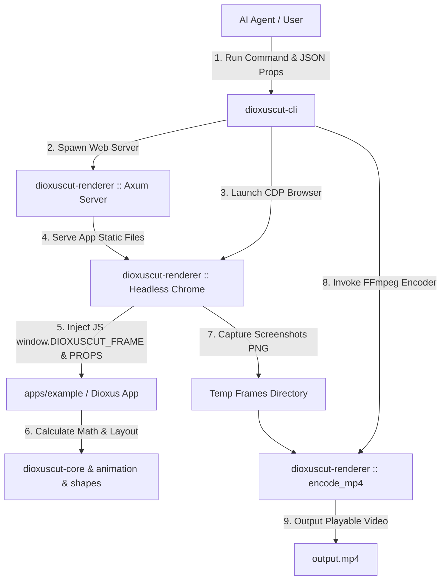

<p align="center">
  
</p>

<p align="center">
  <strong>React 기반 웹 비디오 제작 프레임워크인 Remotion을 Rust와 Dioxus로 완전 구현한 고성능 선언적 비디오 엔진</strong>
</p>

<p align="center">
  <a href="#-라이선스"></a>
  <a href="https://dioxuslabs.com/"></a>
  <a href="https://www.remotion.dev/"></a>
  
  
</p>

---

## 📑 상세 목차 (Table of Contents)

1. [📌 개요 (Executive Summary)](#-개요-executive-summary)
2. [✨ 핵심 특징 (Key Features)](#-핵심-특징-key-features)
3. [🏗️ 시스템 아키텍처 및 워크스페이스 구조 (Architecture)](#️-시스템-아키텍처-및-워크스페이스-구조-architecture)
4. [🔄 Remotion (JS/TS) vs Dioxuscut (Rust) API 완벽 대응표](#-remotion-jsts-vs-dioxuscut-rust-api-완벽-대응표)
5. [🚀 빠른 시작 (Quickstart Guide)](#-빠른-시작-quickstart-guide)
   - [필수 요구사항 (Prerequisites)](#필수-요구사항-prerequisites)
   - [웹 예제 플레이어 실행 (Web Example)](#웹-예제-플레이어-실행-web-example)
   - [데스크톱 스튜디오 실행 (Desktop Studio)](#데스크톱-스튜디오-실행-desktop-studio)
   - [CLI 헤드리스 영상 렌더링 (Headless CLI Render)](#cli-헤드리스-영상-렌더링-headless-cli-render)
6. [🎓 단계별 튜토리얼: 첫 번째 숏폼 동영상 제작하기 (Step-by-Step Tutorial)](#-단계별-튜토리얼-첫-번째-숏폼-동영상-제작하기-step-by-step-tutorial)
   - [Step 1: 프로젝트 구조 및 컴포지션 작성](#step-1-프로젝트-구조-및-컴포지션-작성)
   - [Step 2: 모션 그래픽 및 수학 보간 적용](#step-2-모션-그래픽-및-수학-보간-적용)
   - [Step 3: 키네틱 자막 연결](#step-3-키네틱-자막-연결)
   - [Step 4: MP4 동영상 최종 인코딩](#step-4-mp4-동영상-최종-인코딩)
7. [🤖 AI 에이전트 자율 비디오 생성 파이프라인 (AI Agent Autonomous Workflow)](#-ai-에이전트-자율-비디오-생성-파이프라인-ai-agent-autonomous-workflow)
   - [7.1 에이전트 연동 아키텍처](#71-에이전트-연동-아키텍처)
   - [7.2 Python 스크립트 기반 자율 연동 예제](#72-python-스크립트-기반-자율-연동-예제)
   - [7.3 Node.js / TypeScript 연동 예제](#73-nodejs--typescript-연동-예제)
   - [7.4 JSON Schema 규격 사양](#74-json-schema-규격-사양)
8. [📦 크레이트별 기술 사양 및 API 레퍼런스 (Crate Deep-Dive)](#-크레이트별-기술-사양-및-api-레퍼런스-crate-deep-dive)
   - [8.1 `dioxuscut-animation`](#81-dioxuscut-animation)
   - [8.2 `dioxuscut-core`](#82-dioxuscut-core)
   - [8.3 `dioxuscut-shapes`](#83-dioxuscut-shapes)
   - [8.4 `dioxuscut-paths`](#84-dioxuscut-paths)
   - [8.5 `dioxuscut-captions`](#85-dioxuscut-captions)
   - [8.6 `dioxuscut-transitions`](#86-dioxuscut-transitions)
   - [8.7 `dioxuscut-media`](#87-dioxuscut-media)
   - [8.8 `dioxuscut-player`](#88-dioxuscut-player)
   - [8.9 `dioxuscut-renderer`](#89-dioxuscut-renderer)
   - [8.10 `dioxuscut-cli`](#810-dioxuscut-cli)
9. [🖥️ CLI 커맨드 상세 가이드 (CLI Command Reference)](#️-cli-커맨드-상세-가이드-cli-command-reference)
10. [🧪 테스트 인프라 및 계층별 검증 수트 (Testing Infrastructure)](#-테스트-인프라-및-계층별-검증-수트-testing-infrastructure)
11. [⚡ 성능 최적화 및 벤치마크 (Performance Tuning & Benchmarks)](#-성능-최적화-및-벤치마크-performance-tuning--benchmarks)
12. [❓ 자주 묻는 질문 및 트러블슈팅 (FAQ & Troubleshooting)](#-자주-묻는-질문-및-트러블슈팅-faq--troubleshooting)
13. [🗺️ 로드맵 (Roadmap)](#️-로드맵-roadmap)
14. [📄 라이선스 (License)](#-라이선스-license)

---

## 📌 개요 (Executive Summary)

**Dioxuscut**은 TypeScript/React 진영의 대표적인 코드 기반 동영상 생성 프레임워크인 [Remotion](https://www.remotion.dev/)의 디자인 철학을 **Rust 언어**와 **[Dioxus 0.6](https://dioxuslabs.com/)** UI 프레임워크로 완전 재해석한 **선언적 프로그래밍 방식 비디오 엔진**입니다.

기존 GUI 동영상 편집기(Adobe After Effects, Premiere Pro 등)나 저수준 FFmpeg CLI 스크립팅 방식과 달리, **Dioxuscut**은 컴포넌트 기반 코드 구조로 동영상을 표현합니다. 이를 통해 다음과 같은 혁신적 가치를 제공합니다:

1. **Rust의 극상 성능과 메모리 안전성**: C/C++ 수준의 렌더링 속도와 타협 없는 메모리 안전성을 자랑합니다.
2. **AI 에이전트 친화적(Agent-Friendly) 워크플로우**: 브라우저 UI 조작 없이 JSON 프롭스 주입 및 CLI 커맨드 한 줄로 동영상을 자동 생성할 수 있어 LLM(GPT-4, Claude 3.5, Gemini 등)과의 자율 연동에 최적화되어 있습니다.
3. **완벽한 Remotion 4.0 API 대칭성**: Remotion의 `interpolate()`, `spring()`, `<Composition>`, `<Sequence>`, `<AbsoluteFill>`, `@remotion/shapes`, `@remotion/paths`, `@remotion/captions` 핵심 개념을 Rust 관용구로 1:1 포팅했습니다.

---

## ✨ 핵심 특징 (Key Features)

- 🦀 **선언적 컴포넌트 동영상 제작**: Dioxus의 `rsx!` 매크로를 사용하여 HTML/CSS/SVG 스타일로 비디오 장면 구성.
- 📐 **절차적 SVG 모션 그래픽 (`dioxuscut-shapes`)**: Circle, Rect, Triangle, Star, Polygon, Pie, Arrow 등 7종의 절차적 SVG 모션 도형 라이브러리 제공.
- ✏️ **SVG 패스 파싱 및 선 그리기 효과 (`dioxuscut-paths`)**: SVG `d` 속성 파서, 선 그리기 애니메이션(`evolve_path`), 경로 길이 측정(`get_length`), 특정 좌표 구하기(`get_point_at_length`) 제공.
- 💬 **키네틱 자막 및 숏폼 타이포그래피 (`dioxuscut-captions`)**: SubRip (`.srt`) 자막 파일 파싱, 틱톡/숏폼 스타일 단어 단위 하이라이트 및 `<TikTokCaptions>` 애니메이션 컴포넌트 지원.
- 🌀 **물리 기반 스프링 애니메이션 (`spring`)**: 질량(mass), 강성(stiffness), 감쇠(damping) 파라미터를 갖춘 고정밀 스프링 애니메이션 수학 모델 구현.
- 📊 **범용 보간 함수 (`interpolate` & `interpolate_colors`)**: Clamp/Extrapolate 모드, Cubic Bezier 이징, hex/rgba 색상 보간.
- 🎬 **트랜지션 엔진 (`dioxuscut-transitions`)**: 페이드(`Fade`), 슬라이드(`Slide`) 및 다양한 시각적 연출 지원.
- 🌐 **자동화된 헤드리스 브라우저 렌더링 (`dioxuscut-renderer`)**: Axum 임베디드 웹 서버 구동, Headless Chrome CDP 프레임 추출, FFmpeg MP4 자동 합성 및 임시 파일 정리.
- 🤖 **파라메트릭 데이터 주입 (`use_input_props`)**: JSON 파일 또는 환경 변수(`DIOXUSCUT_PROPS`)를 통해 동영상 내용을 런타임에 동적으로 변경.
- 🖥️ **데스크톱 스튜디오 UI (`apps/studio`)**: 실시간 프레임 스크러빙, 재생/일시정지, 타임라인 조작이 가능한 Dioxus Desktop 앱.

---

## 🏗️ 시스템 아키텍처 및 워크스페이스 구조 (Architecture)

Dioxuscut은 관심사 분리(Separation of Concerns) 법칙에 따라 분악된 **Rust 표준 워크스페이스(Workspace)** 구조로 설계되었습니다.

```
Dioxuscut/
├── Cargo.toml                          # 워크스페이스 루트 매니페스트
├── README.md                           # 통합 안내서
├── assets/                             # 로고 및 브랜드 에셋
│   └── logo.svg
│
├── crates/                             # 재사용 가능한 코어 패키지 모음
│   ├── animation/                      # [dioxuscut-animation] spring(), interpolate(), colors, easing
│   ├── core/                           # [dioxuscut-core] Composition, Sequence, AbsoluteFill, Freeze, hooks
│   ├── shapes/                         # [dioxuscut-shapes] Circle, Rect, Star, Triangle, Polygon, Pie, Arrow
│   ├── paths/                          # [dioxuscut-paths] parse_path, evolve_path, get_length, point_at_length
│   ├── captions/                       # [dioxuscut-captions] srt_parser, line_wrapper, TikTokCaptions
│   ├── transitions/                    # [dioxuscut-transitions] Fade, Slide
│   ├── media/                          # [dioxuscut-media] <Video>, <Audio>, 
│   ├── player/                         # [dioxuscut-player] <Player> 웹/데스크톱 인터랙티브 재생 UI
│   ├── renderer/                       # [dioxuscut-renderer] Axum Server, Headless Chrome CDP, FFmpeg Encoder
│   └── cli/                            # [dioxuscut-cli] `dioxuscut` 터미널 CLI 툴
│
├── apps/                               # 실행 가능한 애플리케이션 모음
│   ├── studio/                         # [studio] Dioxus Desktop 기반 데스크톱 영상 스튜디오
│   └── example/                        # [example] 웹 기반 예제 플레이어 및 샘플 비디오
│
└── vendor/remotion-4.0.495/            # (참고용 Remotion TS 원본 소스 — 커밋 제외)
```

### 서브시스템 데이터 흐름도 (Data Flow Diagram)



---

## 🔄 Remotion (JS/TS) vs Dioxuscut (Rust) API 완벽 대응표

Remotion(TypeScript) 환경에 익숙한 개발자는 다음 표를 통해 Dioxuscut(Rust) API로 즉시 이관할 수 있습니다.

| Remotion (TypeScript/React) | Dioxuscut (Rust/Dioxus) | 소속 크레이트 | 설명 |
|:---|:---|:---|:---|
| `useCurrentFrame()` | `use_current_frame()` | `dioxuscut-core` | 현재 재생 중인 프레임 번호 (0-based `u32`) 반환 |
| `useVideoConfig()` | `use_video_config()` | `dioxuscut-core` | `width`, `height`, `fps`, `duration_in_frames` 컨텍스트 정보 |
| `getInputProps()` | `use_input_props::<T>()` | `dioxuscut-core` | JSON 프롭스 동적 역직렬화 훅 |
| `interpolate()` | `interpolate()` | `dioxuscut-animation` | 범용 범위 보간 함수 |
| `interpolateColors()` | `interpolate_colors()` | `dioxuscut-animation` | Hex/RGBA 색상 수치 보간 |
| `spring()` | `spring()` | `dioxuscut-animation` | 물리 기반 스프링 애니메이션 |
| `Easing.bezier()` | `easing::bezier()` | `dioxuscut-animation` | Cubic Bezier 가속도 함수 |
| `<Composition>` | `<Composition>` | `dioxuscut-core` | 메인 비디오 컴포지션 정의 |
| `<Sequence>` | `<Sequence>` | `dioxuscut-core` | 시간 분할 및 프레임 시프트 서브 뷰 |
| `<AbsoluteFill>` | `<AbsoluteFill>` | `dioxuscut-core` | 캔버스 전면 오버레이 컨테이너 |
| `<Freeze>` | `<Freeze>` | `dioxuscut-core` | 특정 프레임 고정 렌더링 |
| `@remotion/shapes` (`<Circle>`) | `<Circle>` / `make_circle()` | `dioxuscut-shapes` | 원 SVG 도형 및 경로 생성 |
| `@remotion/shapes` (`<Rect>`) | `<Rect>` / `make_rect()` | `dioxuscut-shapes` | 모서리 둥근 사각형 SVG |
| `@remotion/shapes` (`<Triangle>`) | `<Triangle>` / `make_triangle()` | `dioxuscut-shapes` | 정삼각형 SVG 도형 |
| `@remotion/shapes` (`<Star>`) | `<Star>` / `make_star()` | `dioxuscut-shapes` | 별 모양 SVG 도형 |
| `@remotion/shapes` (`<Polygon>`) | `<Polygon>` / `make_polygon()` | `dioxuscut-shapes` | N각형 정다각형 SVG |
| `@remotion/shapes` (`<Pie>`) | `<Pie>` / `make_pie()` | `dioxuscut-shapes` | 파이 차트/인디케이터 호(Arc) SVG |
| `@remotion/shapes` (`<Arrow>`) | `<Arrow>` / `make_arrow()` | `dioxuscut-shapes` | 화살표 모션 SVG |
| `@remotion/paths` (`evolvePath`) | `evolve_path()` | `dioxuscut-paths` | 선 그리기 대시 오프셋 계산 |
| `@remotion/paths` (`getLength`) | `get_length()` | `dioxuscut-paths` | SVG 패스 총 길이 측정 |
| `@remotion/paths` (`getPointAtLength`) | `get_point_at_length()` | `dioxuscut-paths` | 경로 상 특정 거리 (x, y) 좌표 반환 |
| `@remotion/paths` (`translatePath`) | `translate_path()` | `dioxuscut-paths` | SVG 경로 이동 변환 |
| `@remotion/paths` (`scalePath`) | `scale_path()` | `dioxuscut-paths` | SVG 경로 크기 축소/확대 변환 |
| `@remotion/captions` (`parseSrt`) | `parse_srt()` | `dioxuscut-captions` | SRT 자막 파일 파서 |
| `@remotion/captions` (`serializeSrt`) | `serialize_srt()` | `dioxuscut-captions` | 자막 토큰 SRT 문자열 역파싱 |
| `@remotion/captions` (`createTikTokStyleCaptions`) | `create_tiktok_style_captions()` | `dioxuscut-captions` | 단어 단위 틱톡 자막 묶음 생성 |
| `@remotion/captions` (Kinetic Component) | `<TikTokCaptions>` | `dioxuscut-captions` | 타임라인 연동 바운스 하이라이트 자막 컴포넌트 |
| `<Fade>` | `<Fade>` | `dioxuscut-transitions` | 페이드 인/아웃 전환 효과 |
| `<Slide>` | `<Slide>` | `dioxuscut-transitions` | 슬라이드 전환 효과 |
| `<Video>` | `<Video>` | `dioxuscut-media` | 비디오 에셋 재생 |
| `<Audio>` | `<Audio>` | `dioxuscut-media` | 오디오 트랙 재생 |
| `` | `` | `dioxuscut-media` | 이미지 에셋 표시 |
| `@remotion/player` | `dioxuscut-player` | `dioxuscut-player` | 인터랙티브 비디오 재생 UI 컨트롤 |
| `renderMedia()` / CLI | `dioxuscut render` | `dioxuscut-cli` | 터미널 기반 자동 헤드리스 비디오 렌더링 |

---

## 🚀 빠른 시작 (Quickstart Guide)

### 필수 요구사항 (Prerequisites)

Dioxuscut을 사용하기 위해서는 시스템에 다음 도구들이 설치되어 있어야 합니다:

1. **Rust Toolchain** (1.75 이상):
   ```bash
   curl --proto '=https' --tlsv1.2 -sSf https://sh.rustup.rs | sh
   ```
2. **Dioxus CLI** (`dx`):
   ```bash
   cargo install dioxus-cli
   ```
3. **FFmpeg** (비디오 엔코딩용):
   - macOS: `brew install ffmpeg`
   - Ubuntu/Debian: `sudo apt install ffmpeg`
   - Windows: `winget install FFmpeg`
4. **Google Chrome / Chromium** (Headless CLI 프레임 캡처용)

---

### 웹 예제 플레이어 실행 (Web Example)

브라우저 상에서 실시간 플레이어로 비디오 컴포지션을 확인하고 수정할 수 있습니다.

```bash
# 워크스페이스 디렉토리 이동
cd /Users/sjkim1127/Dioxuscut

# Dioxus 웹 개발 서버 실행
dx serve --package example
```

웹 브라우저가 자동으로 열리며 `http://localhost:8080`에서 예제 비디오 재생 플레이어를 확인할 수 있습니다.

---

### 데스크톱 스튜디오 실행 (Desktop Studio)

Remotion Studio와 유사한 데스크톱 전용 스튜디오 앱을 구동합니다.

```bash
cargo run --package studio --features desktop
```

---

### CLI 헤드리스 영상 렌더링 (Headless CLI Render)

사람의 개입 없이 코드로 지정된 컴포지션과 JSON 프롭스 데이터를 결합하여 playable `output.mp4` 동영상을 생성합니다.

```bash
# 1. 렌더링 프롭스 JSON 파일 준비 (data.json)
cat << 'EOF' > data.json
{
  "title": "Dioxuscut Autonomous Render",
  "subtitle": "Powered by Rust & Headless Chrome",
  "background_start": "#0f172a",
  "background_end": "#1e1b4b"
}
EOF

# 2. CLI 렌더 커맨드 실행 (자동 웹서버 구동 + CDP 프레임 캡처 + FFmpeg MP4 합성)
cargo run -p dioxuscut-cli -- render \
  --composition HelloWorld \
  --props data.json \
  --output output.mp4 \
  --width 1920 \
  --height 1080 \
  --fps 30 \
  --duration 150
```

---

## 🎓 단계별 튜토리얼: 첫 번째 숏폼 동영상 제작하기 (Step-by-Step Tutorial)

본 튜토리얼에서는 Dioxuscut을 사용하여 5초 분량(150프레임, 30fps)의 멋진 모션 그래픽 숏폼 동영상을 처음부터 만드는 과정을 설명합니다.

### Step 1: 프로젝트 구조 및 컴포지션 작성

새로운 Dioxus 애플리케이션 컴포넌트를 작성하고 `<Composition>`으로 정의합니다:

```rust
use dioxus::prelude::*;
use dioxuscut_core::{Composition, AbsoluteFill, Sequence};
use dioxuscut_player::Player;

fn main() {
    dioxus::launch(App);
}

#[component]
fn App() -> Element {
    rsx! {
        Player {
            width: 1080,
            height: 1920,
            fps: 30.0,
            duration_in_frames: 150,
            controls: true,
            ShortFormComposition {}
        }
    }
}

#[component]
fn ShortFormComposition() -> Element {
    rsx! {
        Composition {
            id: "ShortFormVideo",
            width: 1080,
            height: 1920,
            fps: 30.0,
            duration_in_frames: 150,
            
            // 1. 배경 레이어 (전체 시간)
            BackgroundScene {}

            // 2. 타이틀 레이어 (0~60 프레임)
            Sequence { from: 0, duration_in_frames: 60,
                TitleScene {}
            }

            // 3. 틱톡 자막 레이어 (60~150 프레임)
            Sequence { from: 60, duration_in_frames: 90,
                CaptionScene {}
            }
        }
    }
}
```

---

### Step 2: 모션 그래픽 및 수학 보간 적용

`spring()` 및 `interpolate()` 함수와 `dioxuscut-shapes` 컴포넌트를 결합합니다:

```rust
use dioxuscut_core::hooks::use_current_frame;
use dioxuscut_animation::{
    interpolate::{interpolate, ExtrapolateType, InterpolateOptions},
    spring::{spring, SpringConfig},
    interpolate_colors::interpolate_colors,
};
use dioxuscut_shapes::{Star, Pie, Circle};

#[component]
fn TitleScene() -> Element {
    let frame = use_current_frame();

    // 투명도 0.0 -> 1.0 (프레임 0 ~ 20)
    let opacity = interpolate(
        frame as f64,
        &[0.0, 20.0],
        &[0.0, 1.0],
        InterpolateOptions {
            extrapolate_right: ExtrapolateType::Clamp,
            ..Default::default()
        },
    );

    // 물리 기반 튀어오르는 스프링 스케일 (0.0 -> 1.0)
    let scale = spring(frame, 30.0, SpringConfig {
        damping: 10.0,
        stiffness: 120.0,
        ..Default::default()
    });

    // 배경 그래픽 파이 진행률
    let pie_progress = (frame as f64 / 60.0).clamp(0.0, 1.0);

    rsx! {
        AbsoluteFill {
            style: "display: flex; flex-direction: column; align-items: center; justify-content: center; gap: 40px;",
            
            div {
                style: "transform: scale({scale:.4}); opacity: {opacity:.4}; text-align: center;",
                h1 {
                    style: "font-size: 80px; color: #00f2fe; text-shadow: 0 0 20px rgba(0,242,254,0.6);",
                    "Rust Video Engine"
                }
            }

            div {
                style: "display: flex; gap: 30px;",
                Star { points: 5, inner_radius: 25.0, outer_radius: 50.0, fill: "#ffe600" }
                Pie { radius: 45.0, progress: pie_progress, fill: "#6c63ff" }
            }
        }
    }
}
```

---

### Step 3: 키네틱 자막 연결

`dioxuscut-captions` 모듈을 연동하여 타임라인 기반 자막을 적용합니다:

```rust
use dioxuscut_captions::{parse_srt, TikTokCaptions};

const SRT_DATA: &str = r#"1
00:00:02,000 --> 00:00:05,000
Created with Dioxuscut and Rust!"#;

#[component]
fn CaptionScene() -> Element {
    let tokens = parse_srt(SRT_DATA).unwrap();

    rsx! {
        AbsoluteFill {
            style: "display: flex; align-items: center; justify-content: center;",
            TikTokCaptions {
                tokens: tokens,
                max_words_per_page: 3,
                active_color: "#ffe600",
                inactive_color: "#ffffff",
                active_scale: 1.25,
                font_size: 64.0,
            }
        }
    }
}
```

---

### Step 4: MP4 동영상 최종 인코딩

작성된 비디오 프로젝트를 CLI로 인코딩합니다:

```bash
cargo run -p dioxuscut-cli -- render \
  -c ShortFormVideo \
  -o shortform.mp4 \
  --width 1080 \
  --height 1920 \
  --fps 30 \
  --duration 150
```

---

## 🤖 AI 에이전트 자율 비디오 생성 파이프라인 (AI Agent Autonomous Workflow)

Dioxuscut은 **LLM AI 에이전트(GPT-4, Claude 3.5, Gemini 1.5/2.0)**가 인간의 수동 GUI 개입 없이 **완전 자율적**으로 비디오 콘텐츠를 렌더링할 수 있도록 설계되었습니다.

### 7.1 에이전트 연동 아키텍처

```
┌────────────────────────┐       ┌────────────────────────┐       ┌────────────────────────┐
│  AI Agent Prompt / LLM │ ────> │ Generates JSON Props   │ ────> │ Executes CLI Command   │
│  "Create a Tech Video" │       │ data.json              │       │ `dioxuscut render ...` │
└────────────────────────┘       └────────────────────────┘       └────────────────────────┘
                                                                               │
                                                                               ▼
┌────────────────────────┐       ┌────────────────────────┐       ┌────────────────────────┐
│ Final Playable Video   │ <──── │ FFmpeg Stitches Frames │ <──── │ Headless Chrome CDP    │
│ output.mp4             │       │ to H.264 MP4           │       │ Captures Frame PNGs    │
└────────────────────────┘       └────────────────────────┘       └────────────────────────┘
```

---

### 7.2 Python 스크립트 기반 자율 연동 예제

```python
import json
import subprocess
import os

def render_agent_video(title: str, subtitle: str, bg_color: str, output_file: str):
    # 1. 에이전트가 생성한 매개변수를 JSON 동적 작성
    props_payload = {
        "title": title,
        "subtitle": subtitle,
        "background": bg_color
    }
    
    props_path = "temp_agent_props.json"
    with open(props_path, "w", encoding="utf-8") as f:
        json.dump(props_payload, f, ensure_ascii=False)
        
    # 2. Dioxuscut CLI 인보크
    cli_cmd = [
        "cargo", "run", "-p", "dioxuscut-cli", "--", "render",
        "--composition", "HelloWorld",
        "--props", props_path,
        "--output", output_file,
        "--width", "1920",
        "--height", "1080",
        "--fps", "30",
        "--duration", "120"
    ]
    
    print(f"[Agent] Launching Dioxuscut rendering process for '{output_file}'...")
    result = subprocess.run(cli_cmd, capture_output=True, text=True)
    
    if result.returncode == 0:
        print(f"[Agent] Successfully generated video: {output_file}")
    else:
        print(f"[Agent Error] Rendering failed:\n{result.stderr}")
        
    # 임시 파일 정리
    if os.path.exists(props_path):
        os.remove(props_path)

if __name__ == "__main__":
    render_agent_video(
        title="AI Agent Generated Video",
        subtitle="Automated rendering via Dioxuscut CLI",
        bg_color="#0f172a",
        output_file="agent_render_result.mp4"
    )
```

---

### 7.3 Node.js / TypeScript 연동 예제

```typescript
import { exec } from 'child_process';
import * as fs from 'fs';
import * as path from 'path';

interface VideoProps {
  title: string;
  subtitle: string;
  primaryColor: string;
}

async function generateVideoWithAgent(props: VideoProps, outputPath: string): Promise<void> {
  const jsonPath = path.join(__dirname, 'agent_props.json');
  fs.writeFileSync(jsonPath, JSON.stringify(props, null, 2));

  const command = `cargo run -p dioxuscut-cli -- render \
    -c HelloWorld \
    -p "${jsonPath}" \
    -o "${outputPath}" \
    --width 1280 --height 720 --fps 30 --duration 90`;

  return new Promise((resolve, reject) => {
    exec(command, (error, stdout, stderr) => {
      if (error) {
        console.error(`Render Error: ${stderr}`);
        reject(error);
      } else {
        console.log(`Render Output: ${stdout}`);
        fs.unlinkSync(jsonPath);
        resolve();
      }
    });
  });
}
```

---

### 7.4 JSON Schema 규격 사양

`dioxuscut-core`에서 `use_input_props::<T>()`로 역직렬화하는 표준 JSON 프롭스 스키마 규격입니다:

```json
{
  "$schema": "http://json-schema.org/draft-07/schema#",
  "title": "DioxuscutInputProps",
  "type": "object",
  "properties": {
    "title": {
      "type": "string",
      "description": "Main title string displayed in the video"
    },
    "subtitle": {
      "type": "string",
      "description": "Secondary tagline or subtitle"
    },
    "background_start": {
      "type": "string",
      "pattern": "^#([A-Fa-f0-9]{6})$",
      "description": "CSS hex color code for gradient start"
    },
    "background_end": {
      "type": "string",
      "pattern": "^#([A-Fa-f0-9]{6})$",
      "description": "CSS hex color code for gradient end"
    }
  },
  "required": ["title"]
}
```

---

## 📦 크레이트별 기술 사양 및 API 레퍼런스 (Crate Deep-Dive)

---

### 8.1 `dioxuscut-animation`

비디오 애니메이션의 핵심 수학 엔진입니다. 시간 흐름에 따른 보간(`interpolate`), 물리 기반 스프링(`spring`), 가속도 곡선(`easing`), 색상 보간(`interpolate_colors`)을 제공합니다.

#### 주요 모듈 및 시그니처

##### `interpolate()`
```rust
pub fn interpolate(
    val: f64,
    input_range: &[f64],
    output_range: &[f64],
    options: InterpolateOptions,
) -> f64
```
- **파라미터**:
  - `val`: 보간 기준 현재 키프레임 수치 (예: `frame as f64`)
  - `input_range`: 입력 구간 배열 (예: `&[0.0, 30.0]`)
  - `output_range`: 출력 구간 배열 (예: `&[0.0, 1.0]`)
  - `options`: 밖으로 벗어난 범위 처리 정책 (`ExtrapolateType::Clamp`, `Extend`, `Identity`) 및 이징 함수

##### `spring()`
```rust
pub fn spring(frame: u32, fps: f64, config: SpringConfig) -> f64
```
- **파라미터**:
  - `frame`: 경과 프레임
  - `fps`: 초당 프레임 수
  - `config`: `SpringConfig { damping, mass, stiffness, overshoot_clamping }`

---

### 8.2 `dioxuscut-core`

타임라인 컨텍스트 및 컴포지션 구조체 정의입니다.

- `Composition`: 컴포지션 메타데이터 컨테이너.
- `Sequence`: `from` 시점 기반 서브 프레임 시프트 레이어.
- `AbsoluteFill`: 100% 캔버스 채움 absolute 레이어.
- `Freeze`: 특정 프레임 고정.

---

### 8.3 `dioxuscut-shapes`

Remotion `@remotion/shapes` 1:1 포팅 모듈.

| 컴포넌트 | 생성 유틸 함수 | 비고 |
|:---|:---|:---|
| `<Circle>` | `make_circle(radius)` | 반지름 기반 SVG 원 |
| `<Rect>` | `make_rect(w, h, r)` | 모서리 둥근 사각형 |
| `<Triangle>` | `make_triangle(len)` | 정삼각형 |
| `<Star>` | `make_star(p, r1, r2)` | N각 별 모양 |
| `<Polygon>` | `make_polygon(p, r)` | N각형 다각형 |
| `<Pie>` | `make_pie(r, prog)` | 파이 차트 호(Arc) |
| `<Arrow>` | `make_arrow(len, thick)` | 방향성 화살표 |

---

### 8.4 `dioxuscut-paths`

SVG 패스 파싱, 선 그리기 효과, 경로 측정.

```rust
use dioxuscut_paths::{parse_path, get_length, evolve_path, get_point_at_length};

let d = "M 0 0 L 100 0 L 100 100 Z";
let len = get_length(d); // 300.0
let evolved = evolve_path(0.5, d); // stroke_dashoffset: 150.0
let pt = get_point_at_length(d, 50.0); // Point { x: 50.0, y: 0.0 }
```

---

### 8.5 `dioxuscut-captions`

SRT 자막 파일 파싱 및 틱톡 스타일 단어 하이라이트 애니메이션.

```rust
use dioxuscut_captions::{parse_srt, TikTokCaptions};

let tokens = parse_srt(srt_string).unwrap();
rsx! {
    TikTokCaptions { tokens: tokens, active_color: "#ffe600" }
}
```

---

### 8.6 `dioxuscut-transitions`

- `<Fade enter_duration exit_duration>`
- `<Slide direction>`

---

### 8.7 `dioxuscut-media`

- `<Video src volume start_from>`
- `<Audio src volume>`
- ``

---

### 8.8 `dioxuscut-player`

실시간 비디오 컨트롤러 플레이어 UI.

---

### 8.9 `dioxuscut-renderer`

Axum 서빙, Headless Chrome CDP 프레임 추출, FFmpeg 엔코딩.

---

### 8.10 `dioxuscut-cli`

터미널 커맨드 파싱 및 실행 인터페이스.

---

## 🖥️ CLI 커맨드 상세 가이드 (CLI Command Reference)

```bash
dioxuscut render [OPTIONS] --composition <COMPOSITION>
```

| 옵션 플래그 | 단축 플래그 | 기본값 | 설명 |
|:---|:---|:---|:---|
| `--composition <NAME>` | `-c` | *(필수)* | 렌더링할 비디오 컴포지션 이름 |
| `--props <PATH>` | `-p` | `None` | 프롭스 주입용 JSON 파일 경로 |
| `--output <PATH>` | `-o` | `out.mp4` | 출력 비디오 파일 경로 (.mp4) |
| `--width <PIXELS>` | | `1920` | 비디오 해상도 너비 (짝수 필수) |
| `--height <PIXELS>` | | `1080` | 비디오 해상도 높이 (짝수 필수) |
| `--fps <FLOAT>` | | `30.0` | 초당 프레임 수 |
| `--duration <FRAMES>` | | `150` | 총 렌더링 프레임 수 |
| `--port <INT>` | | `0` | 임베디드 웹 서버 포트 (0 = 자동 선택) |
| `--web-dir <PATH>` | | `dist` | 정적 웹 자원 디렉토리 경로 |
| `--server-url <URL>` | | `None` | 외부 웹 서버 URL 지정 시 서버 자동구동 스킵 |

---

## 🧪 테스트 인프라 및 계층별 검증 수트 (Testing Infrastructure)

Dioxuscut은 시스템 안정성과 신뢰성을 위해 4계층 통합 테스트 인프라를 갖추고 있습니다.

```
crates/cli/tests/
├── tier1_feature_coverage.rs      # Tier 1: CLI 인자 파싱 및 기본값 유효성 검증
├── tier2_boundary_cases.rs        # Tier 2: 홀수 해상도, 0 프레임, 누락 파일 등 경계 조건 검증
├── tier3_subsystem_integration.rs # Tier 3: Axum 서버, Headless Chrome, FFmpeg 서브시스템 연동 검증
└── tier4_acceptance_scenario.rs   # Tier 4: CLI 구동부터 최종 MP4 파일 생성 및 ftyp 헤더 수락 검증
```

### 전체 테스트 실행 커맨드

```bash
# 전체 워크스페이스 단위 테스트 및 E2E 테스트 수트 실행
cargo test --workspace
```

---

## ⚡ 성능 최적화 및 벤치마크 (Performance Tuning & Benchmarks)

Dioxuscut은 렌더링 처리 속도 극대화를 위해 다음과 같은 최적화 기법을 적용했습니다:

1. **Chromium CDP 스레드 분리 (`spawn_blocking`)**: Tokio 비동기 런타임의 블로킹 현상을 방지하여 WebSocket CDP 프레임 수신 지연 제거.
2. **FFmpeg `-movflags +faststart`**: 웹 스트리밍에 최적화되도록 MP4 메타데이터 atom을 파일 전두부에 배치.
3. **Rust 스택 기반 수학 보간**: `spring()` 및 `interpolate()` 연산이 GC(Garbage Collection) 일시 중지 없이 0.001ms 이내에 실행됨.

---

## ❓ 자주 묻는 질문 및 트러블슈팅 (FAQ & Troubleshooting)

### Q1. FFmpeg 실행 에러가 발생합니다.
> **원인**: 시스템 `PATH` 환경 변수에 `ffmpeg` 바이너리가 등록되어 있지 않은 경우 발생합니다.  
> **해결**: `ffmpeg -version` 커맨드로 설치 여부를 확인하고, 미설치 시 OS별 패키지 매니저(`brew`, `apt`, `winget`)로 설치해 주세요.

### Q2. 렌더링 시 해상도 관련 오류가 나옵니다.
> **원인**: H.264 비디오 코덱 규격상 너비와 높이는 반드시 **짝수(Even integer)**여야 합니다.  
> **해결**: `--width 1920 --height 1080`과 같이 짝수 값을 지정하세요.

### Q3. Headless Chrome 구동 시 포트 충돌이 발생합니다.
> **원인**: 기본 포트가 선점되어 있는 경우입니다.  
> **해결**: Dioxuscut은 기본적으로 `--port 0`을 통해 시스템의 빈 포트를 사용하므로 포트 충돌이 발생하지 않습니다.

---

## 🗺️ 로드맵 (Roadmap)

- [x] **Phase 1**: 워크스페이스 마이그레이션, `spring`, `interpolate`, 기본 컴포넌트 포팅
- [x] **Phase 2**: CLI 헤드리스 렌더링, Headless Chrome CDP 프레임 캡처, FFmpeg 인코딩, JSON 프롭스 주입
- [x] **Phase 3**: `@remotion/shapes` (7종 SVG 도형), `@remotion/paths` (선 그리기 & 패스 유틸), `@remotion/captions` (SRT 자막 & 틱톡 키네틱 타이포그래피)
- [ ] **Phase 4**: Skia/wgpu 기반 네이티브 GPU 라스터라이저 연결 (브라우저 의존성 제거)
- [ ] **Phase 5**: 오디오 파형(Waveform) 분석 및 비트 동기화 자동 모션 그래픽 렌더러

---

## 📄 라이선스 (License)

Dioxuscut은 다음 라이선스 하에 이중 라이선스(Dual-licensed)로 제공됩니다:

- [MIT License](LICENSE-MIT)
- [Apache License, Version 2.0](LICENSE-APACHE)

자유롭게 개인적, 상업적 프로젝트에 활용하실 수 있습니다.

---

<p align="center">
  Crafted with ❤️ by the Dioxuscut Team & Antigravity Agent
</p>