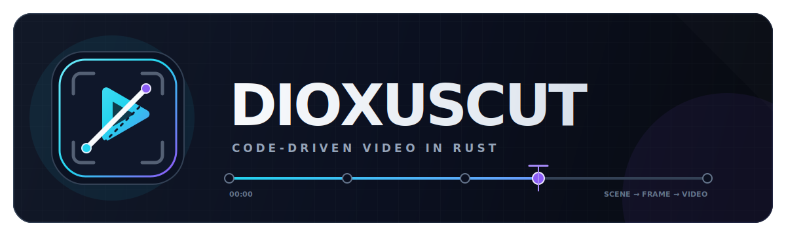
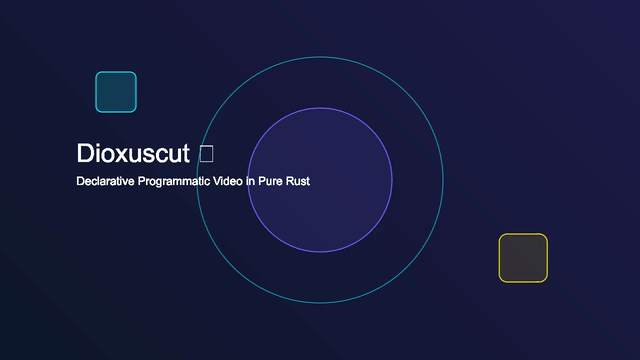

<p align="center">
  
</p>

<p align="center">
  <b>Code-driven programmatic video for Rust. Pure-native, browser-free Remotion port to Dioxus.</b>
</p>

<p align="center">
  <a href="https://crates.io/crates/dioxuscut-core"></a>
  <a href="#-license"></a>
  <a href="https://dioxuslabs.com/"></a>
  <a href="https://www.remotion.dev/"></a>
  
  
</p>

<p align="center">
  
</p>

---

**Dioxuscut** is a declarative, code-first video creation framework written entirely in Rust. You define video compositions as Dioxus components, and the engine renders them directly to MP4 files via a **pure-Rust native CPU (`tiny-skia`) / GPU (`wgpu`) rasterizer** and zero-copy FFmpeg stdin pipe — **no Chrome browser required**.

*(The video banner above was generated programmatically in 2.6 seconds using `dioxuscut render`!)*


## Table of Contents

- [Why Dioxuscut?](#why-dioxuscut)
- [Workspace Overview](#workspace-overview)
- [Crates](#crates)
- [Remotion API Parity](#remotion-api-parity)
- [Quickstart](#quickstart)
- [Tutorial: Your First Video](#tutorial-your-first-video)
- [AI Agent Integration](#ai-agent-integration)
- [CLI Reference](#cli-reference)
- [Testing](#testing)
- [Roadmap](#roadmap)
- [License](#license)

---

## Why Dioxuscut?

Traditional video editing tools are GUI-first. Remotion introduced code-driven video in React, but requires a full Node.js runtime and Headless Chrome.

Dioxuscut eliminates the browser runtime entirely:

- **100% Browser-Free** — Native Rust CPU (`tiny-skia`) & GPU (`wgpu`) rasterizers. No Chrome installation or CDP overhead.
- **Zero-Copy Stdin Pipe** — Multi-threaded Rayon workers stream raw RGBA bytes directly into FFmpeg stdin. Zero intermediate PNG disk I/O.
- **Rayon Multi-Threading** — Parallel frame rendering across all available CPU cores.
- **Reproducibility & Determinism** — Zero garbage collection pauses. Identical input guarantees identical output.
- **AI Agent Native** — Single binary deployment with zero-dependency execution.

---

## Workspace Overview

```
Dioxuscut/
├── Cargo.toml            # Workspace root
├── assets/
│   └── logo.svg
│
├── crates/
│   ├── animation/        # spring(), interpolate(), easing, color interpolation
│   ├── core/             # Composition, Sequence, AbsoluteFill, Freeze, hooks
│   ├── shapes/           # SVG shape primitives: Circle, Rect, Star, Pie, Arrow …
│   ├── paths/            # SVG path parsing, evolve_path, get_length, get_point_at_length
│   ├── captions/         # SRT parser, line wrapper, TikTok-style kinetic captions
│   ├── noise/            # Simplex noise 2D/3D/4D, seed hashing, NoiseBackground
│   ├── rasterizer/       # Pure-Rust CPU (tiny-skia) & GPU (wgpu) rasterizer + ab_glyph text
│   ├── transitions/      # Fade, Slide scene transitions
│   ├── media/            # <Video>, <Audio>,  asset components
│   ├── player/           # Interactive <Player> UI for web and desktop
│   ├── renderer/         # Embedded Axum web server + FFmpeg MP4 compiler
│   └── cli/              # `dioxuscut render` terminal command
│
└── apps/
    ├── studio/           # Dioxus Desktop editing studio
    └── example/          # Web-based composition preview
```

---

## Crates

### `dioxuscut-rasterizer`
The pure-Rust native rendering engine. Replaces Headless Chrome:
- **Scene Graph IR**: `Rect`, `Circle`, `Path`, `Text`, `LinearGradient`, `RadialGradient`, `Group`
- **`TinySkiaBackend`**: Multi-core CPU rasterizer using `tiny-skia`. Works everywhere without GPU or browser drivers.
- **`WgpuBackend`**: GPU-accelerated offscreen shader renderer (`--features gpu`).
- **`FontCache`**: TTF font discovery and glyph layout via `ab_glyph`.
- **`render_to_ffmpeg_pipe`**: Zero-copy Rayon multi-threaded pipeline streaming raw RGBA bytes directly to FFmpeg stdin.

### `dioxuscut-animation`
Physics and math engine. Provides `spring()`, `interpolate()`, `interpolate_colors()`, and Bezier easing.

### `dioxuscut-core`
Timeline primitives and context hooks. Provides `<Composition>`, `<Sequence>`, `<AbsoluteFill>`, `<Freeze>`, `use_current_frame()`, `use_video_config()`, and `use_input_props::<T>()`.

### `dioxuscut-shapes`
Procedural SVG motion graphics primitives. Ported from `@remotion/shapes`.

### `dioxuscut-paths`
SVG path utilities: `parse_path`, `evolve_path`, `get_length`, `get_point_at_length`, `translate_path`, `scale_path`. Ported from `@remotion/paths`.

### `dioxuscut-captions`
Subtitle parsing and rendering: SRT parser, `create_tiktok_style_captions`, `<TikTokCaptions>` component. Ported from `@remotion/captions`.

### `dioxuscut-noise`
Deterministic Simplex noise (2D/3D/4D) + `<NoiseBackground>`. Ported from `@remotion/noise`.

### `dioxuscut-cli`
The `dioxuscut render` CLI tool. Drives native multi-core rasterization and FFmpeg pipe encoding.

---

## Quickstart

### Prerequisites

```bash
# Rust toolchain (1.75+)
curl --proto '=https' --tlsv1.2 -sSf https://sh.rustup.rs | sh

# FFmpeg
brew install ffmpeg        # macOS
sudo apt install ffmpeg    # Debian/Ubuntu
```

*(No Chrome or browser installation required!)*

### Headless CLI render

```bash
# Create a props file
echo '{"title":"Hello Dioxuscut","subtitle":"Pure Rust Native Render"}' > props.json

# Render to MP4 via Native CPU rasterizer
cargo run -p dioxuscut-cli -- render \
  --composition HelloWorld \
  --props props.json \
  --output output.mp4 \
  --width 1920 \
  --height 1080 \
  --fps 30 \
  --duration 150
```

---

## AI Agent Integration

Dioxuscut is designed for zero-dependency AI agent video generation pipelines.

```
LLM Agent
  │
  ├─ writes ──→ props.json        (parametric content)
  │
  └─ runs ───→ dioxuscut render   (CLI)
                    │
                    ├─ Rayon Parallel Workers (CPU / GPU)
                    ├─ Zero-copy stdin pipe
                    └─ encodes ─→ output.mp4  (FFmpeg H.264)
```

---

## CLI Reference

```
dioxuscut render [OPTIONS]
```

| Flag | Short | Default | Description |
|------|-------|---------|-------------|
| `--composition <NAME>` | `-c` | *(required)* | Composition ID to render |
| `--props <PATH>` | `-p` | — | JSON file path for input props |
| `--output <PATH>` | `-o` | `out.mp4` | Output file path |
| `--width <PX>` | | `1920` | Canvas width (must be even) |
| `--height <PX>` | | `1080` | Canvas height (must be even) |
| `--fps <FLOAT>` | | `30.0` | Frames per second |
| `--duration <FRAMES>` | | `150` | Total frame count |
| `--backend <TYPE>` | | `native` | `native` (CPU tiny-skia) or `gpu` (wgpu) |

---

## License

Dual-licensed under [MIT](LICENSE-MIT) or [Apache 2.0](LICENSE-APACHE) at your option.

---

<p align="center">
  Built with 🦀 Rust &nbsp;·&nbsp; Powered by <a href="https://dioxuslabs.com/">Dioxus</a> &nbsp;·&nbsp; Inspired by <a href="https://www.remotion.dev/">Remotion</a>
</p>