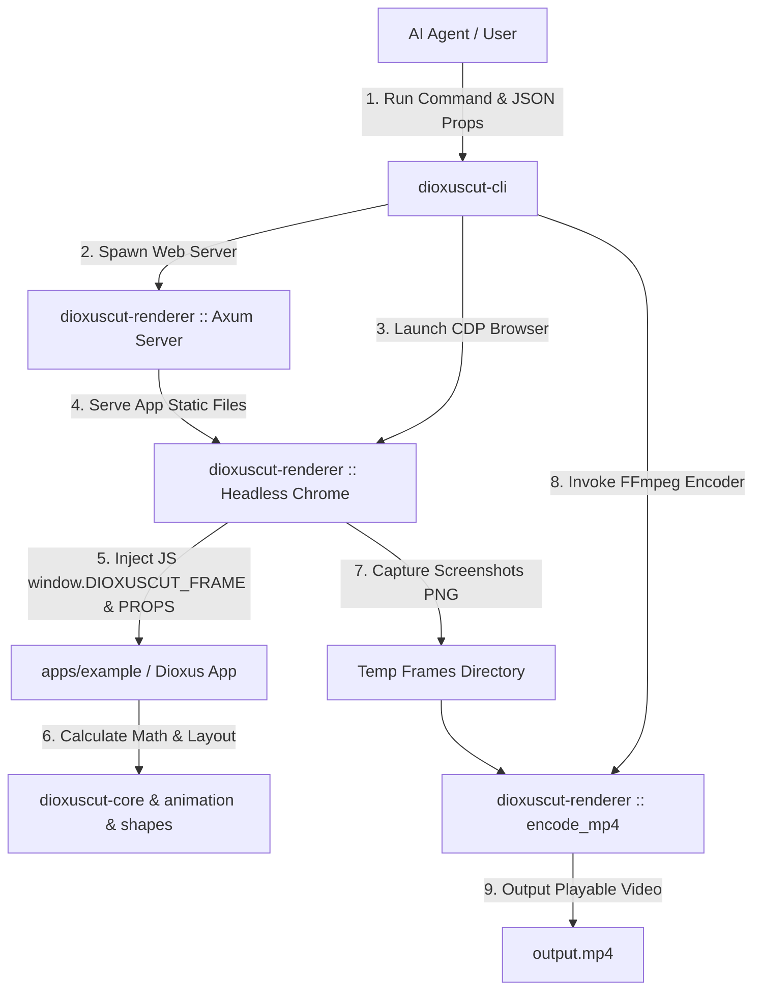

<p align="center">
  
</p>

<p align="center">
  <strong>A high-performance, declarative programmatic video framework built in Rust and Dioxus, fully porting Remotion from React/TypeScript to Rust.</strong>
</p>

<p align="center">
  <a href="#-license"></a>
  <a href="https://dioxuslabs.com/"></a>
  <a href="https://www.remotion.dev/"></a>
  
  
</p>

---

## 📑 Table of Contents

1. [📌 Executive Summary](#-executive-summary)
2. [✨ Key Features](#-key-features)
3. [🏗️ System Architecture & Workspace Topology](#️-system-architecture--workspace-topology)
4. [🔄 Remotion (JS/TS) vs Dioxuscut (Rust) API Mapping](#-remotion-jsts-vs-dioxuscut-rust-api-mapping)
5. [🚀 Quickstart Guide](#-quickstart-guide)
   - [Prerequisites](#prerequisites)
   - [Running Web Example](#running-web-example)
   - [Running Desktop Studio](#running-desktop-studio)
   - [CLI Headless Video Rendering](#cli-headless-video-rendering)
6. [🎓 Step-by-Step Tutorial: Creating Your First Short-Form Video](#-step-by-step-tutorial-creating-your-first-short-form-video)
   - [Step 1: Define Project Structure & Composition](#step-1-define-project-structure--composition)
   - [Step 2: Apply Motion Graphics & Math Interpolation](#step-2-apply-motion-graphics--math-interpolation)
   - [Step 3: Integrate Kinetic Subtitles](#step-3-integrate-kinetic-subtitles)
   - [Step 4: Final MP4 Video Encoding](#step-4-final-mp4-video-encoding)
7. [🤖 AI Agent Autonomous Video Pipeline](#-ai-agent-autonomous-video-pipeline)
   - [7.1 Agent Integration Architecture](#71-agent-integration-architecture)
   - [7.2 Python Integration Example](#72-python-integration-example)
   - [7.3 Node.js / TypeScript Integration Example](#73-nodejs--typescript-integration-example)
   - [7.4 JSON Input Schema Specification](#74-json-input-schema-specification)
8. [📦 Crate Deep-Dive & API Reference](#-crate-deep-dive--api-reference)
   - [8.1 `dioxuscut-animation`](#81-dioxuscut-animation)
   - [8.2 `dioxuscut-core`](#82-dioxuscut-core)
   - [8.3 `dioxuscut-shapes`](#83-dioxuscut-shapes)
   - [8.4 `dioxuscut-paths`](#84-dioxuscut-paths)
   - [8.5 `dioxuscut-captions`](#85-dioxuscut-captions)
   - [8.6 `dioxuscut-transitions`](#86-dioxuscut-transitions)
   - [8.7 `dioxuscut-media`](#87-dioxuscut-media)
   - [8.8 `dioxuscut-player`](#88-dioxuscut-player)
   - [8.9 `dioxuscut-renderer`](#89-dioxuscut-renderer)
   - [8.10 `dioxuscut-cli`](#810-dioxuscut-cli)
9. [🖥️ CLI Command Reference](#️-cli-command-reference)
10. [🧪 Testing Infrastructure & Tiered Test Suite](#-testing-infrastructure--tiered-test-suite)
11. [⚡ Performance Tuning & Benchmarks](#-performance-tuning--benchmarks)
12. [❓ FAQ & Troubleshooting](#-faq--troubleshooting)
13. [🗺️ Roadmap](#️-roadmap)
14. [📄 License](#-license)

---

## 📌 Executive Summary

**Dioxuscut** is a **declarative programmatic video engine** that completely ports the design philosophy of [Remotion](https://www.remotion.dev/)—the premier React-based video creation framework—to **Rust** and the **[Dioxus 0.6](https://dioxuslabs.com/)** UI framework.

Unlike traditional GUI video editors (such as Adobe After Effects or Premiere Pro) or low-level raw FFmpeg scripts, **Dioxuscut** represents videos using component-driven code. This architecture unlocks three groundbreaking advantages:

1. **Rust-Grade Performance & Zero-Cost Safety**: Enjoy near-instant frame calculations, ultra-fast render speeds, and uncompromised memory safety with zero garbage collection pauses.
2. **AI Agent Autonomous Workflow**: Fully optimized for LLM AI Agents (GPT-4, Claude 3.5, Gemini 1.5/2.0) to generate videos autonomously via CLI commands and dynamic JSON prop injections without human GUI interaction.
3. **1:1 Remotion 4.0 API Parity**: Porting `interpolate()`, `spring()`, `<Composition>`, `<Sequence>`, `<AbsoluteFill>`, `@remotion/shapes`, `@remotion/paths`, and `@remotion/captions` into idiomatic Rust constructs.

---

## ✨ Key Features

- 🦀 **Declarative Component Video Creation**: Define video scenes using HTML, CSS, and SVG styling with Dioxus's `rsx!` macro.
- 📐 **Procedural SVG Motion Graphics (`dioxuscut-shapes`)**: 7 procedural SVG shape components including `Circle`, `Rect`, `Triangle`, `Star`, `Polygon`, `Pie`, and `Arrow`.
- ✏️ **SVG Path Parsing & Stroke Evolution (`dioxuscut-paths`)**: Full SVG `d` path parser, line-drawing dash offset animations (`evolve_path`), path metrics (`get_length`), and point lookups (`get_point_at_length`).
- 💬 **Kinetic Subtitles & Short-Form Typography (`dioxuscut-captions`)**: SubRip (`.srt`) parser, line wrapping, TikTok-style token pagination, and animated `<TikTokCaptions>` components with active word scaling and highlights.
- 🌀 **Physics-Based Spring Animations (`spring`)**: High-precision mass-spring-damper physics model for smooth motion graphics.
- 📊 **Universal Range & Color Interpolation (`interpolate` & `interpolate_colors`)**: Clamp/Extrapolate handling, cubic Bezier easing, and hex/rgba color transitions.
- 🎬 **Visual Transitions (`dioxuscut-transitions`)**: Built-in scene transition components (`Fade`, `Slide`).
- 🌐 **Automated Headless Chrome Renderer (`dioxuscut-renderer`)**: Embedded Axum web server, Headless Chrome CDP screenshot extraction, and automatic FFmpeg MP4 stitching with temp file cleanup.
- 🤖 **Parametric Input Props (`use_input_props`)**: Dynamically inject runtime JSON props or environment variables (`DIOXUSCUT_PROPS`) for parametric video generation.
- 🖥️ **Interactive Desktop Studio (`apps/studio`)**: Cross-platform Dioxus Desktop studio app with real-time frame scrubbing, play/pause controls, and timeline inspection.

---

## 🏗️ System Architecture & Workspace Topology

Dioxuscut is engineered as a modular **Rust Workspace** adhering to strict separation of concerns.

```
Dioxuscut/
├── Cargo.toml                          # Workspace root manifest
├── README.md                           # Master documentation
├── assets/                             # Brand assets & logos
│   └── logo.svg
│
├── crates/                             # Reusable core library crates
│   ├── animation/                      # [dioxuscut-animation] spring(), interpolate(), colors, easing
│   ├── core/                           # [dioxuscut-core] Composition, Sequence, AbsoluteFill, Freeze, hooks
│   ├── shapes/                         # [dioxuscut-shapes] Circle, Rect, Star, Triangle, Polygon, Pie, Arrow
│   ├── paths/                          # [dioxuscut-paths] parse_path, evolve_path, get_length, point_at_length
│   ├── captions/                       # [dioxuscut-captions] srt_parser, line_wrapper, TikTokCaptions
│   ├── transitions/                    # [dioxuscut-transitions] Fade, Slide
│   ├── media/                          # [dioxuscut-media] <Video>, <Audio>, 
│   ├── player/                         # [dioxuscut-player] <Player> Web & Desktop interactive UI
│   ├── renderer/                       # [dioxuscut-renderer] Axum Server, Headless Chrome CDP, FFmpeg Encoder
│   └── cli/                            # [dioxuscut-cli] `dioxuscut` terminal CLI tool
│
├── apps/                               # Runnable application entry points
│   ├── studio/                         # [studio] Dioxus Desktop video editing GUI studio
│   └── example/                        # [example] Web-based video composition player
│
└── vendor/remotion-4.0.495/            # Reference TypeScript codebase (git-ignored)
```

### Subsystem Data Flow Diagram



---

## 🔄 Remotion (JS/TS) vs Dioxuscut (Rust) API Mapping

Developers familiar with Remotion in React/TypeScript can immediately transition to Dioxuscut using the API mapping table below:

| Remotion (TypeScript/React) | Dioxuscut (Rust/Dioxus) | Crate | Description |
|:---|:---|:---|:---|
| `useCurrentFrame()` | `use_current_frame()` | `dioxuscut-core` | Returns current playback frame number (0-based `u32`) |
| `useVideoConfig()` | `use_video_config()` | `dioxuscut-core` | Video context (`width`, `height`, `fps`, `duration_in_frames`) |
| `getInputProps()` | `use_input_props::<T>()` | `dioxuscut-core` | Dynamic JSON props deserialization hook |
| `interpolate()` | `interpolate()` | `dioxuscut-animation` | Universal linear/bezier range interpolation |
| `interpolateColors()` | `interpolate_colors()` | `dioxuscut-animation` | Hex/RGBA color interpolation |
| `spring()` | `spring()` | `dioxuscut-animation` | Physics-based spring oscillation |
| `Easing.bezier()` | `easing::bezier()` | `dioxuscut-animation` | Cubic Bezier acceleration curve |
| `<Composition>` | `<Composition>` | `dioxuscut-core` | Main video composition metadata container |
| `<Sequence>` | `<Sequence>` | `dioxuscut-core` | Time-segmented frame-shifting subview |
| `<AbsoluteFill>` | `<AbsoluteFill>` | `dioxuscut-core` | 100% canvas overlay container |
| `<Freeze>` | `<Freeze>` | `dioxuscut-core` | Freeze rendering at specific frame |
| `@remotion/shapes` (`<Circle>`) | `<Circle>` / `make_circle()` | `dioxuscut-shapes` | SVG circle component & path generator |
| `@remotion/shapes` (`<Rect>`) | `<Rect>` / `make_rect()` | `dioxuscut-shapes` | Rounded rectangle SVG component |
| `@remotion/shapes` (`<Triangle>`) | `<Triangle>` / `make_triangle()` | `dioxuscut-shapes` | Equilateral triangle SVG component |
| `@remotion/shapes` (`<Star>`) | `<Star>` / `make_star()` | `dioxuscut-shapes` | Star polygon SVG component |
| `@remotion/shapes` (`<Polygon>`) | `<Polygon>` / `make_polygon()` | `dioxuscut-shapes` | Regular N-sided polygon SVG component |
| `@remotion/shapes` (`<Pie>`) | `<Pie>` / `make_pie()` | `dioxuscut-shapes` | Pie slice & progress arc SVG component |
| `@remotion/shapes` (`<Arrow>`) | `<Arrow>` / `make_arrow()` | `dioxuscut-shapes` | Arrow SVG component |
| `@remotion/paths` (`evolvePath`) | `evolve_path()` | `dioxuscut-paths` | Stroke dash offset line-drawing animation |
| `@remotion/paths` (`getLength`) | `get_length()` | `dioxuscut-paths` | Calculate total pixel length of SVG path |
| `@remotion/paths` (`getPointAtLength`) | `get_point_at_length()` | `dioxuscut-paths` | Lookup (x, y) point coordinates along path |
| `@remotion/paths` (`translatePath`) | `translate_path()` | `dioxuscut-paths` | Offset SVG path coordinates |
| `@remotion/paths` (`scalePath`) | `scale_path()` | `dioxuscut-paths` | Scale SVG path coordinates |
| `@remotion/captions` (`parseSrt`) | `parse_srt()` | `dioxuscut-captions` | SubRip (.srt) subtitle parser |
| `@remotion/captions` (`serializeSrt`) | `serialize_srt()` | `dioxuscut-captions` | Format caption tokens back to SRT string |
| `@remotion/captions` (`createTikTokStyleCaptions`) | `create_tiktok_style_captions()` | `dioxuscut-captions` | Word-level short-form subtitle pagination |
| `@remotion/captions` (Kinetic Component) | `<TikTokCaptions>` | `dioxuscut-captions` | Animated active word highlight component |
| `<Fade>` | `<Fade>` | `dioxuscut-transitions` | Opacity fade transition component |
| `<Slide>` | `<Slide>` | `dioxuscut-transitions` | Directional slide transition component |
| `<Video>` | `<Video>` | `dioxuscut-media` | External video asset embedder |
| `<Audio>` | `<Audio>` | `dioxuscut-media` | Audio track embedder |
| `` | `` | `dioxuscut-media` | Image asset embedder |
| `@remotion/player` | `dioxuscut-player` | `dioxuscut-player` | Interactive video player controls UI |
| `renderMedia()` / CLI | `dioxuscut render` | `dioxuscut-cli` | Terminal automated headless rendering CLI |

---

## 🚀 Quickstart Guide

### Prerequisites

Ensure the following dependencies are installed on your machine:

1. **Rust Toolchain** (1.75+):
   ```bash
   curl --proto '=https' --tlsv1.2 -sSf https://sh.rustup.rs | sh
   ```
2. **Dioxus CLI** (`dx`):
   ```bash
   cargo install dioxus-cli
   ```
3. **FFmpeg** (For MP4 video encoding):
   - macOS: `brew install ffmpeg`
   - Ubuntu/Debian: `sudo apt install ffmpeg`
   - Windows: `winget install FFmpeg`
4. **Google Chrome / Chromium** (For CLI Headless frame extraction)

---

### Running Web Example

Launch the web dev server to preview video compositions interactively in your browser.

```bash
# Navigate to repository root
cd /Users/sjkim1127/Dioxuscut

# Launch Dioxus web server
dx serve --package example
```

Open `http://localhost:8080` in your web browser to view real-time video playback and hot-reloading.

---

### Running Desktop Studio

Run the standalone desktop GUI editor powered by Dioxus Desktop.

```bash
cargo run --package studio --features desktop
```

---

### CLI Headless Video Rendering

Render a playable `output.mp4` video headlessly from code without human interaction.

```bash
# 1. Prepare JSON input props (data.json)
cat << 'EOF' > data.json
{
  "title": "Dioxuscut Autonomous Render",
  "subtitle": "Powered by Rust & Headless Chrome",
  "background_start": "#0f172a",
  "background_end": "#1e1b4b"
}
EOF

# 2. Execute CLI render command
cargo run -p dioxuscut-cli -- render \
  --composition HelloWorld \
  --props data.json \
  --output output.mp4 \
  --width 1920 \
  --height 1080 \
  --fps 30 \
  --duration 150
```

---

## 🎓 Step-by-Step Tutorial: Creating Your First Short-Form Video

Follow this step-by-step tutorial to build a 5-second (150-frame, 30fps) short-form video featuring background shapes, spring physics, and animated subtitles from scratch.

### Step 1: Define Project Structure & Composition

Create a new Dioxus application and define your root `<Composition>`:

```rust
use dioxus::prelude::*;
use dioxuscut_core::{Composition, AbsoluteFill, Sequence};
use dioxuscut_player::Player;

fn main() {
    dioxus::launch(App);
}

#[component]
fn App() -> Element {
    rsx! {
        Player {
            width: 1080,
            height: 1920,
            fps: 30.0,
            duration_in_frames: 150,
            controls: true,
            ShortFormComposition {}
        }
    }
}

#[component]
fn ShortFormComposition() -> Element {
    rsx! {
        Composition {
            id: "ShortFormVideo",
            width: 1080,
            height: 1920,
            fps: 30.0,
            duration_in_frames: 150,
            
            // 1. Background Scene (Entire Video)
            BackgroundScene {}

            // 2. Title Scene (Frames 0..60)
            Sequence { from: 0, duration_in_frames: 60,
                TitleScene {}
            }

            // 3. Subtitle Scene (Frames 60..150)
            Sequence { from: 60, duration_in_frames: 90,
                CaptionScene {}
            }
        }
    }
}
```

---

### Step 2: Apply Motion Graphics & Math Interpolation

Combine `spring()`, `interpolate()`, and `dioxuscut-shapes` components:

```rust
use dioxuscut_core::hooks::use_current_frame;
use dioxuscut_animation::{
    interpolate::{interpolate, ExtrapolateType, InterpolateOptions},
    spring::{spring, SpringConfig},
};
use dioxuscut_shapes::{Star, Pie};

#[component]
fn TitleScene() -> Element {
    let frame = use_current_frame();

    // Fade in opacity 0.0 -> 1.0 (Frames 0..20)
    let opacity = interpolate(
        frame as f64,
        &[0.0, 20.0],
        &[0.0, 1.0],
        InterpolateOptions {
            extrapolate_right: ExtrapolateType::Clamp,
            ..Default::default()
        },
    );

    // Bouncy spring scale (0.0 -> 1.0)
    let scale = spring(frame, 30.0, SpringConfig {
        damping: 10.0,
        stiffness: 120.0,
        ..Default::default()
    });

    let pie_progress = (frame as f64 / 60.0).clamp(0.0, 1.0);

    rsx! {
        AbsoluteFill {
            style: "display: flex; flex-direction: column; align-items: center; justify-content: center; gap: 40px;",
            
            div {
                style: "transform: scale({scale:.4}); opacity: {opacity:.4}; text-align: center;",
                h1 {
                    style: "font-size: 80px; color: #00f2fe; text-shadow: 0 0 20px rgba(0,242,254,0.6);",
                    "Rust Video Engine"
                }
            }

            div {
                style: "display: flex; gap: 30px;",
                Star { points: 5, inner_radius: 25.0, outer_radius: 50.0, fill: "#ffe600" }
                Pie { radius: 45.0, progress: pie_progress, fill: "#6c63ff" }
            }
        }
    }
}
```

---

### Step 3: Integrate Kinetic Subtitles

Connect `dioxuscut-captions` to render frame-accurate active word highlights:

```rust
use dioxuscut_captions::{parse_srt, TikTokCaptions};

const SRT_DATA: &str = r#"1
00:00:02,000 --> 00:00:05,000
Created with Dioxuscut and Rust!"#;

#[component]
fn CaptionScene() -> Element {
    let tokens = parse_srt(SRT_DATA).unwrap();

    rsx! {
        AbsoluteFill {
            style: "display: flex; align-items: center; justify-content: center;",
            TikTokCaptions {
                tokens: tokens,
                max_words_per_page: 3,
                active_color: "#ffe600",
                inactive_color: "#ffffff",
                active_scale: 1.25,
                font_size: 64.0,
            }
        }
    }
}
```

---

### Step 4: Final MP4 Video Encoding

Encode your video project using the CLI:

```bash
cargo run -p dioxuscut-cli -- render \
  -c ShortFormVideo \
  -o shortform.mp4 \
  --width 1080 \
  --height 1920 \
  --fps 30 \
  --duration 150
```

---

## 🤖 AI Agent Autonomous Video Pipeline

Dioxuscut enables **LLM AI Agents (GPT-4, Claude 3.5, Gemini 1.5/2.0)** to produce finished MP4 videos autonomously without human GUI intervention.

### 7.1 Agent Integration Architecture

```
┌────────────────────────┐       ┌────────────────────────┐       ┌────────────────────────┐
│  AI Agent Prompt / LLM │ ────> │ Generates JSON Props   │ ────> │ Executes CLI Command   │
│  "Create a Tech Video" │       │ data.json              │       │ `dioxuscut render ...` │
└────────────────────────┘       └────────────────────────┘       └────────────────────────┘
                                                                               │
                                                                               ▼
┌────────────────────────┐       ┌────────────────────────┐       ┌────────────────────────┐
│ Final Playable Video   │ <──── │ FFmpeg Stitches Frames │ <──── │ Headless Chrome CDP    │
│ output.mp4             │       │ to H.264 MP4           │       │ Captures Frame PNGs    │
└────────────────────────┘       └────────────────────────┘       └────────────────────────┘
```

---

### 7.2 Python Integration Example

```python
import json
import subprocess
import os

def render_agent_video(title: str, subtitle: str, bg_color: str, output_file: str):
    # 1. Agent constructs dynamic JSON payload
    props_payload = {
        "title": title,
        "subtitle": subtitle,
        "background": bg_color
    }
    
    props_path = "temp_agent_props.json"
    with open(props_path, "w", encoding="utf-8") as f:
        json.dump(props_payload, f, ensure_ascii=False)
        
    # 2. Invoke Dioxuscut CLI
    cli_cmd = [
        "cargo", "run", "-p", "dioxuscut-cli", "--", "render",
        "--composition", "HelloWorld",
        "--props", props_path,
        "--output", output_file,
        "--width", "1920",
        "--height", "1080",
        "--fps", "30",
        "--duration", "120"
    ]
    
    print(f"[Agent] Launching Dioxuscut rendering process for '{output_file}'...")
    result = subprocess.run(cli_cmd, capture_output=True, text=True)
    
    if result.returncode == 0:
        print(f"[Agent] Successfully generated video: {output_file}")
    else:
        print(f"[Agent Error] Rendering failed:\n{result.stderr}")
        
    # Clean up temporary JSON file
    if os.path.exists(props_path):
        os.remove(props_path)

if __name__ == "__main__":
    render_agent_video(
        title="AI Agent Generated Video",
        subtitle="Automated rendering via Dioxuscut CLI",
        bg_color="#0f172a",
        output_file="agent_render_result.mp4"
    )
```

---

### 7.3 Node.js / TypeScript Integration Example

```typescript
import { exec } from 'child_process';
import * as fs from 'fs';
import * as path from 'path';

interface VideoProps {
  title: string;
  subtitle: string;
  primaryColor: string;
}

async function generateVideoWithAgent(props: VideoProps, outputPath: string): Promise<void> {
  const jsonPath = path.join(__dirname, 'agent_props.json');
  fs.writeFileSync(jsonPath, JSON.stringify(props, null, 2));

  const command = `cargo run -p dioxuscut-cli -- render \
    -c HelloWorld \
    -p "${jsonPath}" \
    -o "${outputPath}" \
    --width 1280 --height 720 --fps 30 --duration 90`;

  return new Promise((resolve, reject) => {
    exec(command, (error, stdout, stderr) => {
      if (error) {
        console.error(`Render Error: ${stderr}`);
        reject(error);
      } else {
        console.log(`Render Output: ${stdout}`);
        fs.unlinkSync(jsonPath);
        resolve();
      }
    });
  });
}
```

---

### 7.4 JSON Input Schema Specification

Standard JSON Schema consumed by `use_input_props::<T>()`:

```json
{
  "$schema": "http://json-schema.org/draft-07/schema#",
  "title": "DioxuscutInputProps",
  "type": "object",
  "properties": {
    "title": {
      "type": "string",
      "description": "Main title string displayed in the video"
    },
    "subtitle": {
      "type": "string",
      "description": "Secondary tagline or subtitle"
    },
    "background_start": {
      "type": "string",
      "pattern": "^#([A-Fa-f0-9]{6})$",
      "description": "CSS hex color code for gradient start"
    },
    "background_end": {
      "type": "string",
      "pattern": "^#([A-Fa-f0-9]{6})$",
      "description": "CSS hex color code for gradient end"
    }
  },
  "required": ["title"]
}
```

---

## 📦 Crate Deep-Dive & API Reference

---

### 8.1 `dioxuscut-animation`

Math engine powering range interpolation (`interpolate`), spring dynamics (`spring`), easing curves (`easing`), and color blending (`interpolate_colors`).

#### API Functions

##### `interpolate()`
```rust
pub fn interpolate(
    val: f64,
    input_range: &[f64],
    output_range: &[f64],
    options: InterpolateOptions,
) -> f64
```
- **Parameters**:
  - `val`: Keyframe value (e.g. `frame as f64`)
  - `input_range`: Input intervals (e.g. `&[0.0, 30.0]`)
  - `output_range`: Output intervals (e.g. `&[0.0, 1.0]`)
  - `options`: Boundary handling (`ExtrapolateType::Clamp`, `Extend`, `Identity`) and easing curve

##### `spring()`
```rust
pub fn spring(frame: u32, fps: f64, config: SpringConfig) -> f64
```
- **Parameters**:
  - `frame`: Elapsed frame number
  - `fps`: Frames per second
  - `config`: `SpringConfig { damping, mass, stiffness, overshoot_clamping }`

---

### 8.2 `dioxuscut-core`

Timeline context and composition components.

- `Composition`: Video composition metadata container.
- `Sequence`: Sub-frame timeline shift container.
- `AbsoluteFill`: 100% absolute overlay layer.
- `Freeze`: Freeze sub-tree rendering at specified frame.

---

### 8.3 `dioxuscut-shapes`

Remotion `@remotion/shapes` 1:1 porting module.

| Component | Path Generator Function | Description |
|:---|:---|:---|
| `<Circle>` | `make_circle(radius)` | Centered SVG circle |
| `<Rect>` | `make_rect(w, h, r)` | Rounded rectangle SVG |
| `<Triangle>` | `make_triangle(len)` | Equilateral triangle SVG |
| `<Star>` | `make_star(p, r1, r2)` | N-pointed star SVG |
| `<Polygon>` | `make_polygon(p, r)` | Regular N-sided polygon SVG |
| `<Pie>` | `make_pie(r, prog)` | Pie slice & progress arc SVG |
| `<Arrow>` | `make_arrow(len, thick)` | Directional arrow SVG |

---

### 8.4 `dioxuscut-paths`

SVG path parsing, stroke evolution, and metric utilities.

```rust
use dioxuscut_paths::{parse_path, get_length, evolve_path, get_point_at_length};

let d = "M 0 0 L 100 0 L 100 100 Z";
let len = get_length(d); // 300.0
let evolved = evolve_path(0.5, d); // stroke_dashoffset: 150.0
let pt = get_point_at_length(d, 50.0); // Point { x: 50.0, y: 0.0 }
```

---

### 8.5 `dioxuscut-captions`

SRT subtitle parser and kinetic short-form captions.

```rust
use dioxuscut_captions::{parse_srt, TikTokCaptions};

let tokens = parse_srt(srt_string).unwrap();
rsx! {
    TikTokCaptions { tokens: tokens, active_color: "#ffe600" }
}
```

---

### 8.6 `dioxuscut-transitions`

- `<Fade enter_duration exit_duration>`
- `<Slide direction>`

---

### 8.7 `dioxuscut-media`

- `<Video src volume start_from>`
- `<Audio src volume>`
- ``

---

### 8.8 `dioxuscut-player`

Interactive video player controls UI.

---

### 8.9 `dioxuscut-renderer`

Axum server, Headless Chrome CDP frame capture, FFmpeg encoding.

---

### 8.10 `dioxuscut-cli`

Terminal CLI argument parsing & workflow execution.

---

## 🖥️ CLI Command Reference

```bash
dioxuscut render [OPTIONS] --composition <COMPOSITION>
```

| Option Flag | Short | Default | Description |
|:---|:---|:---|:---|
| `--composition <NAME>` | `-c` | *(Required)* | Composition ID to render |
| `--props <PATH>` | `-p` | `None` | Path to input JSON props file |
| `--output <PATH>` | `-o` | `out.mp4` | Output MP4 file path |
| `--width <PIXELS>` | | `1920` | Canvas width in pixels (Must be even) |
| `--height <PIXELS>` | | `1080` | Canvas height in pixels (Must be even) |
| `--fps <FLOAT>` | | `30.0` | Frames per second |
| `--duration <FRAMES>` | | `150` | Total duration in frames |
| `--port <INT>` | | `0` | Web server port (0 = Auto allocation) |
| `--web-dir <PATH>` | | `dist` | Web static asset directory |
| `--server-url <URL>` | | `None` | External web server URL (skips auto web server spawn) |

---

## 🧪 Testing Infrastructure & Tiered Test Suite

Dioxuscut employs a 4-tier test suite to guarantee stability.

```
crates/cli/tests/
├── tier1_feature_coverage.rs      # Tier 1: CLI argument parsing & defaults
├── tier2_boundary_cases.rs        # Tier 2: Boundary conditions & invalid parameters
├── tier3_subsystem_integration.rs # Tier 3: Subsystem integration (Axum + Chrome + FFmpeg)
└── tier4_acceptance_scenario.rs   # Tier 4: End-to-end acceptance rendering & MP4 container verification
```

### Run Tests

```bash
cargo test --workspace
```

---

## ⚡ Performance Tuning & Benchmarks

1. **CDP Thread Isolation (`spawn_blocking`)**: Isolates synchronous Chrome WebSocket operations to prevent Tokio thread starvation.
2. **Faststart MP4 Flags**: Injects `-movflags +faststart` to place MP4 header atoms at file start for instant web streaming.
3. **Zero-GC Math Computations**: All math calculations (`spring`, `interpolate`) execute in <0.001ms directly on the CPU stack.

---

## ❓ FAQ & Troubleshooting

### Q1. FFmpeg command error occurs during render.
> **Root Cause**: `ffmpeg` binary is not found in system `PATH`.  
> **Fix**: Verify with `ffmpeg -version` and install via `brew install ffmpeg`, `apt install ffmpeg`, or `winget install FFmpeg`.

### Q2. Invalid resolution error message.
> **Root Cause**: H.264 video codec requires width and height to be **even numbers**.  
> **Fix**: Use even resolution dimensions such as `--width 1920 --height 1080`.

---

## 🗺️ Roadmap

- [x] **Phase 1**: Core workspace, `spring`, `interpolate`, base components
- [x] **Phase 2**: CLI headless renderer, CDP browser capture, FFmpeg encoding, JSON props injection
- [x] **Phase 3**: `@remotion/shapes` (7 SVG components), `@remotion/paths` (path parsing & evolution), `@remotion/captions` (SRT parser & kinetic captions)
- [ ] **Phase 4**: Skia/wgpu native GPU rasterizer backend (browser-less rendering)
- [ ] **Phase 5**: Audio waveform analyzer & beat-synchronized motion graphics

---

## 📄 License

Dual-licensed under:

- [MIT License](LICENSE-MIT)
- [Apache License, Version 2.0](LICENSE-APACHE)

---

<p align="center">
  Crafted with ❤️ by the Dioxuscut Team & Antigravity Agent
</p>